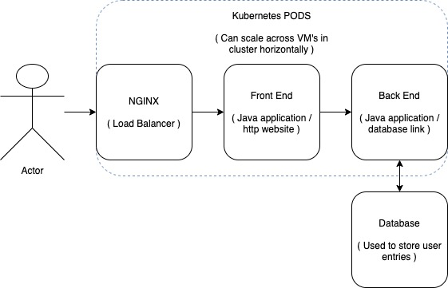
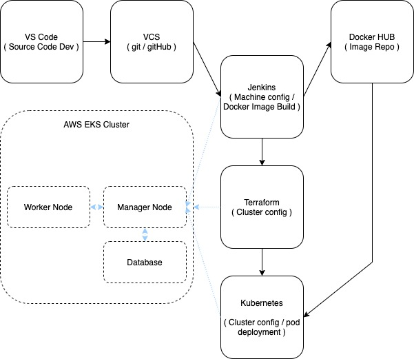

# qa_team_project

Please ignore spelling, spelling error correction isnt working on VSCODE :)
If anything doesnt make sense please leave a comment and ill get to fixing it!

## Table of contents:
- What this project is
- Scope of the project
    - MVP
- Design specification
    - Outline
    - User flow
- Risk assesment
- Kanban board
- Testing
- Pipeline overview
- Services used
- Changes as the project has progressed
- Goals met
- Notes to build

## What this project is
  This project is a deployment of a website via AWS, the source code can be found here:

  https://github.com/spring-petclinic/spring-petclinic-angular

  https://github.com/spring-petclinic/spring-petclinic-rest

  We are to take the source code (Written by a third party) and convert it to images that can be deployed in containers across an AWS Cluster that can scale appropriatley and can receive updates to be deployed across the cluster.

## Scope of the projects
### MVP
There are a few basic requirements this project must hit, they are as followed:
- A Kanban board to track progress
- Use of correct pipeline tools:
  - Jenkins
  - Ansible
  - Terraform
  - Kubernetes
  - Docker (Images Only)
- Deployment of the application via AWS and EKS

## Design specification

### Outline

The project consists of five main parts, these are:

  1. NGINX will be used to balance web traffic to nodes
  2. Nodes running the front end in Kubernetes Pods
  3. Nodes runnig the back end in Kubernetes Pods
  4. A database, this needs to communicate with the backend pods
  5. A server running jenkins and/or docker to configure the cluster

### User flow

  The goal of deploying the resource across a cluster is so that it can scale as demand increases / decreases. As more users are trying to access our service we can deploy more virtual machines running more pods / instances of the application. Likewise, when there is decreased demand we can destroy these resources without harming the user experince whilst still persisting data and ensuring processing power (and money) isnt being wasted.

## Risk assesment

  As with any web application there is always some threat to the application and/or the data it contains. See below for a breakdown of risks assocated and remidies that can be put in place to negate any risks.

| Risk        | Likleyhood | Impact | Description  | Evaluation | Response | Control Measure | New Likelyhood | New Impact |
| :---------- | :--------: | :----: | :----------- | :--------- | :------- | :-------------- | :------------: | :--------: | 
|Too many users could be trying to use your cloud service|2|3|There could be an overwhelming amount of real or fake users trying to access your service or an increased number of processes running|Your entire service could stop working and might lead to errors for other users, it might also overwhelm the cloud service and disrupt other people operations|Service may need to be restricted if this occurs, it will ruin the end user experience|Ensure your using the correct cloud infastructure and ensure that it is flexible, Ensure your application can scale to handle an influx|1|1|
|You release an unstable or broken build|1|3|You may accidentally merge the unstable and stable release branch or unstable code might make it onto the release version|Users might have a bad end experience, buisness may be lost to yourself and to the client|You will need to revert to the latest stable branch|Ensure there are clear rules in place to differentiate between release builds and internal builds, Ensure that testing is thorough and tests every element of the version before release|1|2|
|Data loss that is integeral to function occurs|1|3|You may loose hardware or simply forget data that is key to the program being used, it could be accidentally deleted|The service would be out of operation until the orignal data could be recovered|You would either need to impliment a patch around the data or source new data|Ensure any vital data is backed-up, this may be on the cloud or physically. Using a VCS is a very good measure as it allows you to rollback easily|1|2|
|A first or third party could release important data such as passwords|2|3|A disgruntled employee, yourself or someone else might accidentally or maliciously release senitive information that allows unauthorised users to view sensitive content|Code could be stolen or important information could be leaked|Code would need to be changed, Passwords would need to be changed and re-distributed|Ensure employees are given the relevant access and not overall access, Ensure any important information is stored securley so if its leaked its harder to decode, Use 2FA To secure sensitive info so its not imediatly accesible|1|1|
|Hateful speech may be posted on your website|3|2|Someone may write harmful or abuse content on your website to purposley cause harm to other users|Site may get negative reviews or decreased traffic|The hateful speech will need to be taken down and the user be given limited funcitonality or banned|Validate the information before it is posted to the site, this might be a quick check written in code or migth be a human validation step|1|1|
|Connection to the database is lost|1|3|For whatever reason the connection to the database might be lost|The service will stop working functionally but the website will still be live|A new connection needs to be re-established or a backup of the database needs to be made|Ensure there is a fallback option, also ensure a repulatable cloud service is used. Ensure the used service allows for expansion |1|1|
|Incorrect data may be posted to the website|2|1|A spelling mistake or incorrect piece of information might make it onto the website|Although it wouldnt stop the website functioning it may decrease user satisfacton and again the site may get negative reviews or decreased traffic|Ensure the information is appended quickly and that it is from a repultable source|Ensure all information being posted to the website is factually correct and ensure the original source is reputable|1|1|

## Kanban board

  We will using gitHUBs built in project tracking, we will be using cards with checkboxes and tags to keep track of progress. Each task written must be obatainable and not too extensive. We will divide the tasks evenly among the team hopefully working towards one coherent project

## Testing

  The provided source code includes written tests, it is just a case of us running the tests and artefacting the outcome.

## Pipeline Overview

  The pipeline takes source code from another git repo, it uses the repo to construct docker images and pushes them to a public docker repo. It then uses Jenkins via a AWS Golden AMI to configure a cluster using Terraform. Once the cluster has been setup (with appropriate networking etc) a kubernetes configuration is then deployed. This takes the docker images complied earlier and deploys them to the cluster. This cluster uses NGINX and allows our end user to access the front end pods.

## Services Used

  We have used the following services:

  - Jenkins
  - Docker
  - Terraform
  - Kubernetes
  - AWS EC2
  - AWS EKS
  - AWK VPC (Security Groups, Routetables and subnets)

  We have tried to utilise the free tier on amazon as much as we could, this is to keep costs down. This makes sense in our instance as most the software we are using is open source / free so fits the theme. There is one exception however. We did need to slighlty upgrade the build server and manager node. This was just due to the free EC2 instance being underpowered and not being able to handle our needs. Deploying it this way, we have found, is the most cost efficient method currently. A larger scale deployment may require even more horsepower but for our use case is perfectly acceptable.

## Changes as the project has progressed

  As all the code was written there wasnt much to change when we were developing the back end. The most substaintial change we had made was moving from pre-made docker images to compiling, building and uploading our own docker images straight from the git repo to a public docker repo. This gave us tighter control over what images were being deployed across our cluster.

## Goals met

1. Terraform used to configure AWS EKS cluster
2. Kubernetes used to deploy docker images to cluster

## Notes to build

- Ensure Jenkins credentials are configured to deploy to AWS
- Ensure Jenkins credentials are configured to upload to Docker